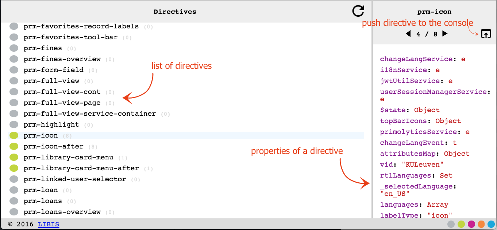
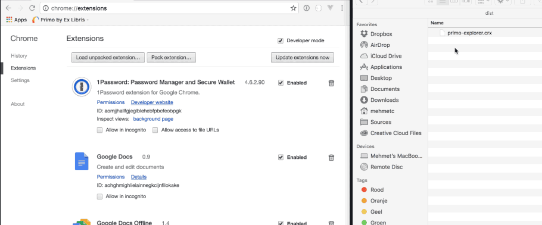
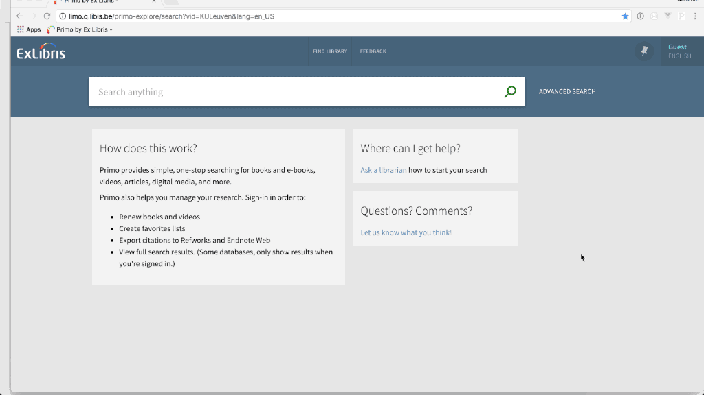

# 

New Primo UI Chrome extension. This is an experiment, currently it shows the defined directives(grey) and the instantiated directives(green).
It shows the first level of the directive and you can push the directive into a variable so it can be used in the console.

## Install
Download the extension from the [dist](dist/primo-explorer.crx) folder and drag it to your Chrome browsers Extension page.

## Activate the explorer
Go to your Primo new UI page. Open up developer tools and start investigating.

